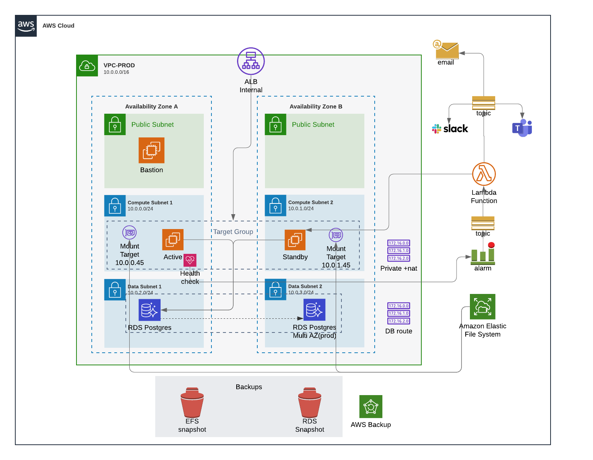

# Readme

---

# Kubernetes Challenge

## Docker-Compose

````shell
docker-compose -f stack.yml
````

## Namespace

   -  devops-tools

## Connexion

    - TENAN_LOGIN = daman
    - TENANT_PASSWORD = Strike$!*

````sh
kubectl create secret generic bonita-tenant-secret --from-literal=username=daman --from-literal=password='Strike$!*' -n devops-tools
````

## Storage Classe

````shell

kubectl get storageclass

NAME            PROVISIONER             RECLAIMPOLICY   VOLUMEBINDINGMODE      ALLOWVOLUMEEXPANSION   AGE
gp2 (default)   kubernetes.io/aws-ebs   Delete          WaitForFirstConsumer   false
````

````shell
kubectl apply -f k8s.yml
````

### Forwarding to Localhost

````shell
kubectl port-forward service/bonita-app 7080:8080
````
---
### Get Pod name

````shell
POD=$(kubectl get pod -o jsonpath="{.items[0].metadata.name}")

kubectl -it exec $POD -- bash
````

### Get log

````shell
kubectl logs $POD

kubectl get cm

kubectl exec $POD -- ls /etc/logging.properties

kubectl exec $POD -- cat /etc/logging.properties

kubectl exec $POD -- ls /opt/custom-init.d

kubectl exec $POD -- cat /opt/bonita/BonitaCommunity-2021.1/server/conf/logging.properties
````

[comment]: <> "kubectl exec $POD -- tail -f /opt/bonita/BonitaCommunity-2021.1/server/logs/bonita.`date +%Y-%m-%d`.log"


## PostgreSQL as an installed service

````shell
ENSURE_DB_CHECK_AND_CREATION=false
DB_VENDOR=postgres
DB_HOST=172.17.0.2
DB_PORT=5432
DB_NAME=custombonitadb
DB_USER=custombonitauser
DB_PASS=custombonitapass
BIZ_DB_NAME=custombusinessdb
BIZ_DB_USER=custombusinessuser
BIZ_DB_PASS=custombusinesspass
````
---

# Architecture Challenge



---

# CI/CD and Coding challenge


Solved it by running a groovy script.

**all_jobs.gsh**
````groovy

import jenkins.model.*
import hudson.model.*
Jenkins.instance.getAllItems(AbstractProject.class).each { println(it.fullName) };
````

````shell
java -jar jenkins-cli.jar -s http://localhost:8080 groovy all_jobs.gsh --username $username --password $password > jobs.csv
````
